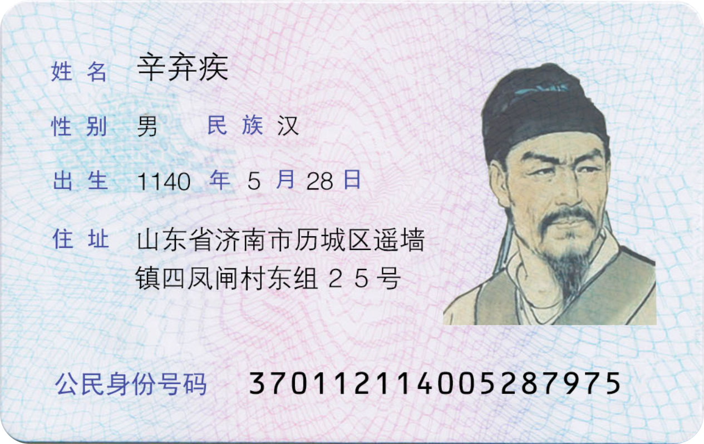
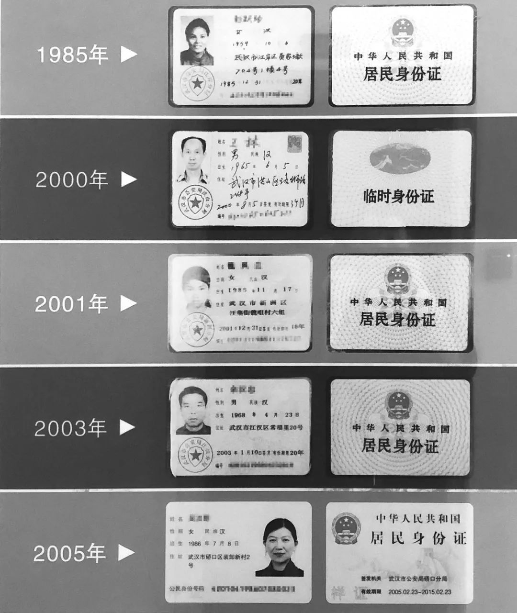

import Callout from '../../../components/Callout.astro';

在这个人人都有移动数字身份的时代，我们手中最轻薄却最重要的一张卡片，莫过于居民身份证。那串由18位数字（或包含字母X）组成的身份证号码，不仅是我们每个人的“终身代码”，更像是一座微型的个人信息数据库。

## 中国身份证发展史

1984 年，第一代居民身份证正式亮相，标志着我国全面启用居民身份证管理制度。早期证件为传统塑膜卡片，搭配 15 位编号，全流程手工制作效率有限，1999 年编号升级为 18 位，彻底规范了身份编码体系。

2004 年起，具备芯片存储功能的第二代身份证逐步普及，防伪与使用体验实现跨越式提升。此后指纹采集成为办证标配，安全等级再度升级。随着 2013 年一代证正式退出历史舞台，我国居民身份证完成重要迭代，小小证件也成为时代发展的鲜活缩影。

## 18位数字里隐藏的秘密

居民身份证号码，正确、正式的称谓应该是“[公民身份号码](https://www.hh.gov.cn/info/12321/746362.htm)”。现在的18位身份证号码，是特征组合码，由十七位数字本体码和一位数字校验码组成。从左到右，它可以精准地拆解为四个部分：

### 1~6位：地址码

这6位数字代表了你首次申报户口时的常住户口所在地[行政区划代码](https://dmfw.mca.gov.cn/XzqhVersionPublish.html)：

- **第1~2位（省级代码）：** 代表省、自治区、直辖市（例如：11代表北京市，31代表上海市，44代表广东省）。
- **第3~4位（地级码）：** 代表地级市、自治州、盟等（例如：01通常代表省会城市）。
- **第5~6位（县级码）：** 代表县、区、旗、县级市。

<Callout type="info" title="冷知识">
  这6位地址码在定下来后，即便你以后把户口迁到了其他城市，你的身份证号码也**永远不会改变**。它记录的是你的“根”。
</Callout>

### 7~14位：出生日期码

这8位数字是最容易识别的，格式为 **YYYYMMDD**：

- **第7~10位：** 出生年份（4位，如1995）。
- **第11~12位：** 出生月份（2位，不足两位前面补0，如05）。
- **第13~14位：** 出生日期（2位，如08）。

### 15~17位：顺序码

这3位数字是在同一地址码所标识的区域范围内，对**同年、同月、同日出生的人**编定的顺序号。其中隐藏了一个关键的性别信息：

- **奇数（1、3、5、7、9）：** 分配给**男性**。
- **偶数（2、4、6、8、0）：** 分配给**女性**。 也就是说，看身份证号码的**第17位**，就能立刻知道此人的性别。

### 第18位：校验码

作为身份证的最后一位，它是通过前17位数字按照一套复杂的数学公式（[ISO 7064:1983](https://www.iso.org/standard/31531.html).MOD 11-2校验码系统）计算出来的。它的作用是**检验整个号码在输入或读取时是否准确无误**。

计算出来的结果可能是0~10中的一个数字：

- 如果结果是0~9，最后一位就直接写对应的数字。
- 如果结果是**10**，为了保证整个身份证号码严格控制在18位、不变成19位，就用罗马数字 **“X”** 来代替。所以，身份证最后的“X”读作“shí”，而不是英文字母“埃克斯”。

简单来说，一张18位的身份证号码，就是一份标准的个人微型档案：**“省+市+区+出生年月日+序列号+性别+计算机校验”**。

这串冰冷的数字背后，其实承载着我国人口管理精细化、科学化的发展历程。保护好我们的身份证号码，不仅是保护我们的个人隐私，更是保护我们在数字世界行走的“通行证”。
