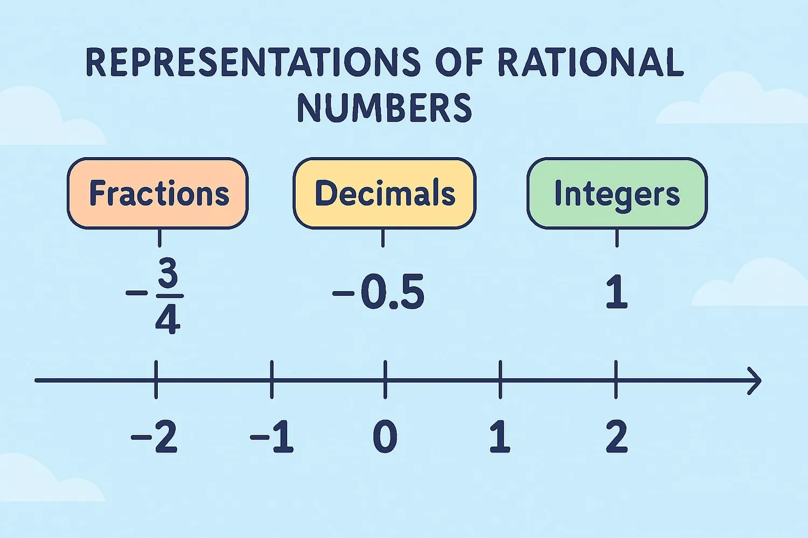
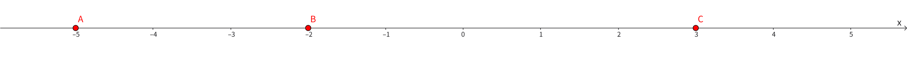

import Callout from '../../../components/Callout.astro';

- 指出下列数中的正整数、负整数、正有理数、负有理数：

  $$-\frac{3}{11},\ 16,\ -9.7,\ -0.56,\ -1.25,\ -10,\ 0,\ 103,\ \frac{17}{5},\ -111,\ 16.53.$$

  <Callout type="success" title="【参考答案】">
    - 正整数：$16,\ 103$
    - 负整数：$-10,\ -111$
    - 正有理数：$16,\ 103,\ \frac{17}{5},\ 16.53$
    - 负有理数：$-\frac{3}{11},\ -9.7,\ -0.56,\ -1.25,\ -10,\ -111$

    (注：$0$ 既不是正数也不是负数，所以不属于以上任何一类。)
  </Callout>

- 下列各数是否存在？如果存在，是多少？

  （1）最小的正整数；

  （2）最大的负整数；

  （3）最小的负整数；

  （4）最小的正有理数。

  <Callout type="success" title="【参考答案】">
    1. 正整数序列 $1,2,3,\dots$，从 $1$ 开始递增，最小正整数为 $1$；
    2. 负整数序列 $-1,-2,-3,\dots$，越靠近 $0$ 数值越大，最大负整数是 $-1$；
    3. 任取负整数 $n$，$n-1$ 仍是更小的负整数，无最小负整数；
    4. 若存在最小正有理数 $a>0$，则 $0<\dfrac{a}{2}<a$，与假设矛盾，故不存在。
  </Callout>

- 如图，点 A，B，C 为数轴上的三个点。

  

  (1) 如果把点 A 向右移动 4 个单位长度到点 D，那么点 B，C，D 表示的数中，哪个数最小？

  (2) 如果把点 C 向左移动 7 个单位长度到点 E，那么点 B 表示的数比点 E 表示的数大多少？

  <Callout type="success" title="【参考答案】">
    1. 点 $B$ 表示的数最小。

        **步骤：** 点 $D = -5 + 4 = -1$。比较 $B(-2)$，$C(3)$，$D(-1)$，可知 $-2$ 最小。

    2. 大 $2$。

        **步骤：** 点 $E = 3 - 7 = -4$。计算：$-2 - (-4) = 2$。
  </Callout>

- 根据下列要求，分别写出各数：

  （1）绝对值是 0.8 的负数；

  （2）绝对值是 5 的数；

  （3）比 -5 大的负整数；

  （4）绝对值小于 3 的非负整数．

  <Callout type="success" title="【参考答案】">
    1. $-0.8$
    2. $5$ 或 $-5$（或写为 $\pm 5$）
    3. $-4, -3, -2, -1$
    4. $0, 1, 2$

        **注意：**“非负整数”包含正整数和 $0$。
  </Callout>

- 计算：

  （1）$(-3) + (-2) + (-1) + (-7) + 7$;

  （2）$4 + (-2) + (-4) + 2 + (-5)$;

  （3）$(-2.75) + 2.5 + (-7.25) + 10.5$;

  （4）$\left(-3\frac{1}{4}\right) + \left(-6\frac{3}{10}\right) + \frac{1}{4} + \left(-3\frac{1}{8}\right) + \left(-\frac{7}{10}\right)$.

  <Callout type="success" title="【参考答案】">
    **(1)**
    $$
    \begin{aligned}
    \text{原式} &= (-3) + (-2) + (-1) + [(-7) + 7] \\
    &= (-6) + 0 \\
    &= -6
    \end{aligned}
    $$

    **(2)**
    $$
    \begin{aligned}
    \text{原式} &= [4 + (-4)] + [(-2) + 2] + (-5) \\
    &= 0 + 0 + (-5) \\
    &= -5
    \end{aligned}
    $$

    **(3)**
    $$
    \begin{aligned}
    \text{原式} &= [(-2.75) + (-7.25)] + (2.5 + 10.5) \\
    &= (-10) + 13 \\
    &= 3
    \end{aligned}
    $$

    **(4)**
    $$
    \begin{aligned}
    \text{原式} &= \left[\left(-3\frac{1}{4}\right) + \frac{1}{4}\right] + \left[\left(-6\frac{3}{10}\right) + \left(-\frac{7}{10}\right)\right] + \left(-3\frac{1}{8}\right) \\
    &= (-3) + (-7) + \left(-3\frac{1}{8}\right) \\
    &= (-10) + \left(-3\frac{1}{8}\right) \\
    &= -13\frac{1}{8}
    \end{aligned}
    $$
  </Callout>
