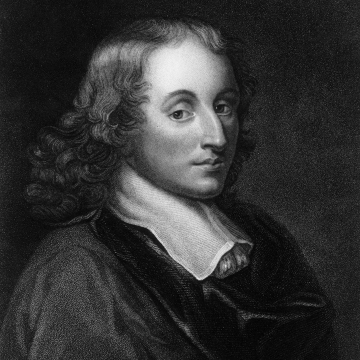

在 17 世纪以前，人们普遍认为打赌赢钱纯粹靠的是“运气”或“神明保佑”，数学家们也觉得赌博是一件低俗且无法用逻辑计算的事情。直到 1654 年，一个著名的赌徒和两位天才数学家的相遇，彻底改变了这一切。

## 赌桌上的困惑

这个故事的主角有三位：

- **梅雷骑士（Chevalier de Méré）**：一位自封为骑士的法国贵族，也是一个资深赌徒。
- **布莱兹·帕斯卡（Blaise Pascal）**：法国天才数学家、物理学家。
- **皮埃尔·德·费马（Pierre de Fermat）**：法国传奇数学家。

某天，梅雷骑士在赌桌上遇到了一个让他百思不得其解的难题，历史上称为“分赌金问题”（Problem of Points）：

> 两个赌徒 A 和 B 在玩一个掷硬币的游戏。双方各出 32 个金币作为赌注，总共 64 个金币。
>
> 规定谁先赢满 3 局，谁就能拿走全部赌注。
>
> 游戏进行得很顺利，A 赢了 2 局，B 赢了 1 局。
>
> 但就在这个时候，现场突发意外，游戏不得不**被迫中止**。

问题来了：**这 64 个金币的赌注，该怎么分才公平？**

当时的赌场流行几种分法，但每一种都有明显的漏洞：

1. **平分**（每人 32 个）：A 坚决抗议：“我明明已经 2 比 1 领先了，再赢一局我就全拿了，凭什么平分？”
2. **全给 A**：B 也会抗议：“虽然我落后，但我不是没有翻盘的可能啊！凭什么全给他？”
3. **按当前胜率分**（A 拿 $2/3$，B 拿 $1/3$）：看似最合理，但梅雷骑士凭借敏锐的直觉，总觉得这种分法在数学逻辑上经不起推敲。

于是，他把这个困扰了赌徒们几百年的问题，写信寄给了他的天才数学家朋友——[帕斯卡](https://en.wikipedia.org/wiki/Blaise_Pascal)。

## 世纪通信：将目光投向未来

帕斯卡看到问题后大感兴趣。他没有把这当成简单的市井赌博，而是敏锐地察觉到，这背后隐藏着一种“对未来不确定性的数学计算”。

由于一个人思考不过瘾，帕斯卡写信给当时远在图卢兹的[费马](https://en.wikipedia.org/wiki/Pierre_de_Fermat)。在 1654 年的夏天，两位数学巨擘通过一封封书信，展开了一场顶级思维碰撞。

他们的伟大之处在于：**抛开了已经发生的过去，将目光投向了“如果没有中断，未来可能会发生什么”。**

因为 A 已经赢了 2 局，B 赢了 1 局，比赛最多只需要再打 **2 局** 就能分出最终胜负。他们穷举了未来可能会发生的所有四种等概率结果：

| **第 1 局结果** | **第 2 局结果** | **最终胜出者**              | **赌金归属**   |
| --------------- | --------------- | --------------------------- | -------------- |
| **A 赢**        | A 赢            | **A 最终胜出**（A 满 3 局） | A 拿走 64 金币 |
| **A 赢**        | B 赢            | **A 最终胜出**（A 满 3 局） | A 拿走 64 金币 |
| **B 赢**        | **A 赢**        | **A 最终胜出**（A 满 3 局） | A 拿走 64 金币 |
| **B 赢**        | **B 赢**        | **B 最终胜出**（B 满 3 局） | B 拿走 64 金币 |

在所有可能发生的 4 种未来里，**A 在 3 种情况下会获胜，而 B 只有在连续赢下两局（第 4 种情况）时才会获胜。**

因此：

- A 获胜的概率是 $\frac{3}{4}$
- B 获胜的概率是 $\frac{1}{4}$

最公平的分法应当是：A 拿走 $64 \times \frac{3}{4} = 48$ 个金币，B 拿走 $64 \times \frac{1}{4} = 16$ 个金币。

## 那份最初的纯粹

这个故事之所以迷人，是因为它诞生在一个极其功利、充满投机和算计的赌桌上，但激荡出的却是人类历史上最纯粹的理性之光：

1. **概率论的诞生**：帕斯卡和费马在解决这个问题的过程中，第一次用数学公式量化了“未来的可能性”，这直接宣告了数学新分支——**概率论**的诞生，并引申出了“数学期望”的概念。
2. **驯服命运的数字**：在他们之前，人类面对未知只能祈求神明或归咎于运气；在他们之后，人类发现可以用逻辑和数字去推演未知的明天。

如今的概率论被广泛应用于华尔街的金融数据、大数据的流量算计以及各种复杂的商业博弈中，充满了算计与铜臭。

但当我们顺着历史的坐标轴回望，这门学科在最初诞生的时候，不过是两个数学家为了帮朋友公平地分掉赌桌上的几个金币，而在草稿纸上写下的、对未来最纯粹的逻辑推演。
