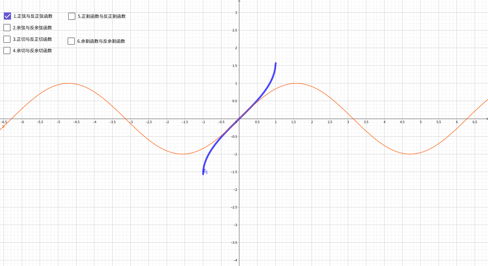
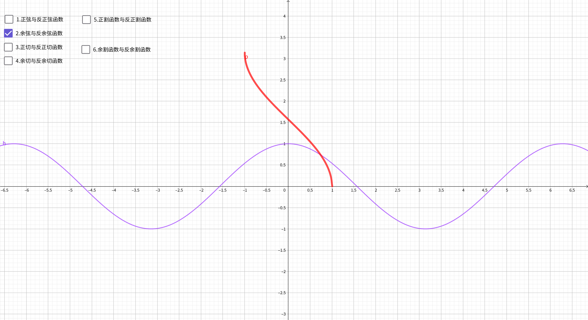
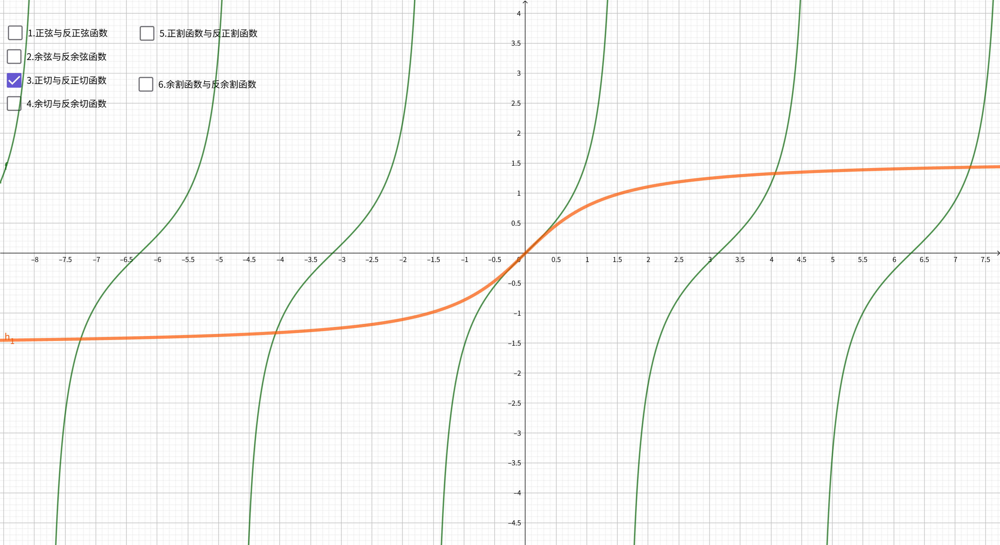
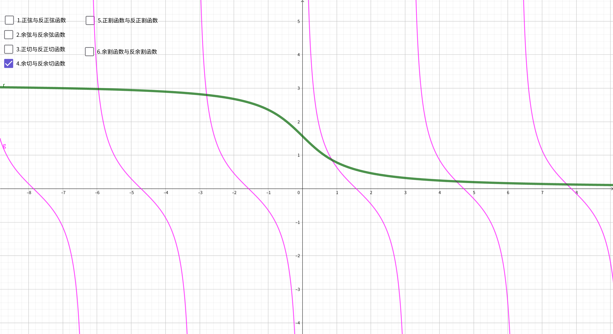
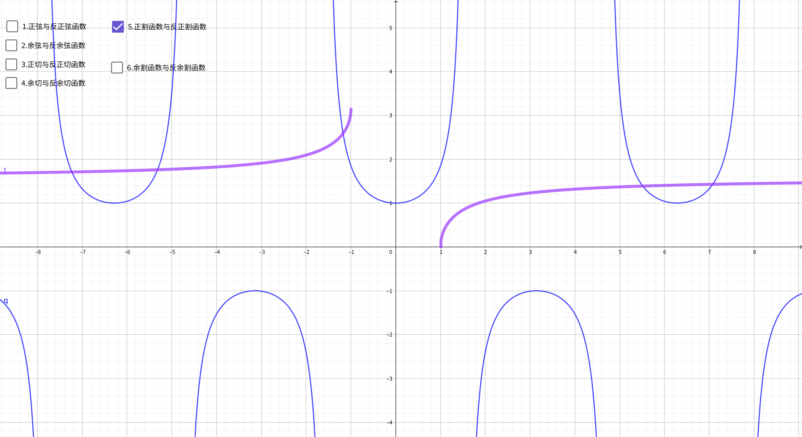
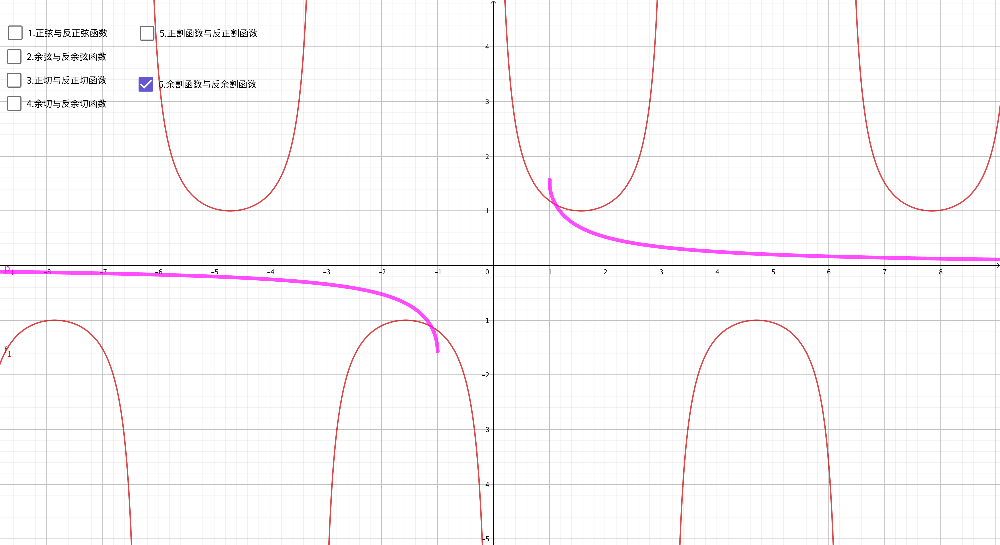

对于反三角函数公式 $y = f^{-1}(x)$，我们可以这样拆解它的核心要素：

1. **输入值 $x$**：三角函数的**比值**（线段长度的比值，是一个纯数字）。
2. **输出值 $y$**：一个**弧度值/角度**（在严格的函数定义中，它是一个实数，对应弧度制）。
3. **约束条件**：输出的 $y$ 必须落在规定的**主值区间**内。

## 为什么需要限制“值域”？

这是学习反三角函数时最容易让人头疼的地方。因为三角函数是周期函数（例如 $\sin(30^\circ)=0.5$、$\sin(150^\circ)=0.5$、$\sin(390^\circ)=0.5$），如果我们问：“哪个角度的正弦值是 $0.5$？”，答案会有无数个。

为了让反三角函数变成一个**合格的函数**（即保证**单值对应**：输入一个值，只能得到一个确定的输出），数学家们硬性规定了一段单调区间作为范围，称为**主值区间**。

以下是六个反三角函数的完整对照表：

| **函数名称** | **符号表示**                       | **读作**      | **含义**                 | **定义域（输入 x）**              | **值域/主值范围（输出角度 y）**                                                                                          |
| ------------ | ---------------------------------- | ------------- | ------------------------ | --------------------------------- | ------------------------------------------------------------------------------------------------------------------------ |
| **反正弦**   | $\arcsin x$ 或 $\sin^{-1}x$        | Arc-sine      | 哪个角度的正弦值是 $x$？ | $[-1, 1]$                         | $\left[-\frac{\pi}{2}, \frac{\pi}{2}\right]$ 即 $[-90^\circ, 90^\circ]$                                                  |
| **反余弦**   | $\arccos x$ 或 $\cos^{-1}x$        | Arc-cosine    | 哪个角度的余弦值是 $x$？ | $[-1, 1]$                         | $[0, \pi]$ 即 $[0^\circ, 180^\circ]$                                                                                     |
| **反正切**   | $\arctan x$ 或 $\tan^{-1}x$        | Arc-tangent   | 哪个角度的正切值是 $x$？ | $\mathbb{R}$（全体实数）          | $\left(-\frac{\pi}{2}, \frac{\pi}{2}\right)$ 即 $(-90^\circ, 90^\circ)$                                                  |
| **反余切**   | $\text{arccot } x$ 或 $\cot^{-1}x$ | Arc-cotangent | 哪个角度的余切值是 $x$？ | $\mathbb{R}$（全体实数）          | $(0, \pi)$ 即 $(0^\circ, 180^\circ)$                                                                                     |
| **反正割**   | $\text{arcsec } x$ 或 $\sec^{-1}x$ | Arc-secant    | 哪个角度的正割值是 $x$？ | $(-\infty, -1] \cup [1, +\infty)$ | $\left[0, \frac{\pi}{2}\right) \cup \left(\frac{\pi}{2}, \pi\right]$ 即 $[0^\circ, 90^\circ) \cup (90^\circ, 180^\circ]$ |
| **反余割**   | $\text{arccsc } x$ 或 $\csc^{-1}x$ | Arc-cosecant  | 哪个角度的余割值是 $x$？ | $(-\infty, -1] \cup [1, +\infty)$ | $\left[-\frac{\pi}{2}, 0\right) \cup \left(0, \frac{\pi}{2}\right]$ 即 $[-90^\circ, 0^\circ) \cup (0^\circ, 90^\circ]$   |

## 图像特征

> 💡 **图像小贴士**：反三角函数的图像与其对应的三角函数（限制定义域后）关于直线 $y=x$ 对称。

### 反正弦函数 $y = \arcsin x$

### 反余弦函数 $y = \arccos x$

### 反正切函数 $y = \arctan x$

### 反余切函数 $\text{arccot } x$

### 反正割函数 $\text{arcsec } x$

### 反余割函数 $\text{arccsc } x$

